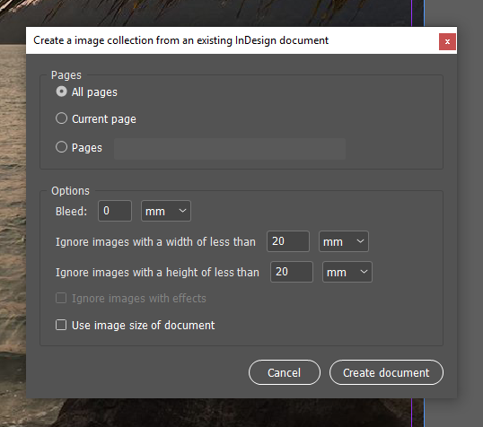

# ImCompose
A simple-to-use plugin for InDesign CC 14.0 and above to create a collection of pictures from the images of a document.

## Installation
### As toolbar item (recommended)
Download the [script](./ImCompose.jsx) and put it into the startup scripts folder, which usually can be found at `%appdata%\Adobe\InDesign\Version 14.0\de_DE\Scripts\Startup Scripts` for Windows users. Depending on your InDesign version, you might have to use a different directory than `Version 14.0`. After restarting InDesign, you should see it as a new menu item in the "File">"New" submenu.
### As normal script
Download the [script](./ImCompose.jsx) and put it into the script panel folder, which usually can be found at `%appdata%\Adobe\InDesign\Version 14.0\de_DE\Scripts\Scripts Panel` for Windows users. Depending on your InDesign version, you might have to use a different directory than `Version 14.0`. After restarting InDesign, you should see it in the scripts panel.

## Features and Bugs
The script detects the language of your installation and will then either be displayed in English (default) or German. 

This was a small project I created to help me doing this very repetitive task faster. I have used it over the years and it seems to perform well in the majority of cases - but if you find any bugs that can be reproduced reliably, feel free to open a new issue.
